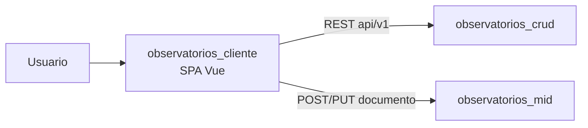

# Arquitectura e integraciones — observatorios_cliente

## Arquitectura del repositorio
- Stack: Vue 3 + Vite + Vuetify + Pinia + Vue Router.
- Patrón principal: SPA con capa de servicios HTTP por dominio funcional.

## Diagrama de contexto

## Contratos e interacciones esperadas
| Sistema destino | Propósito | Evidencia técnica |
|---|---|---|
| `observatorios_crud` | CRUD de entidades del dominio observatorios | Variables de entorno/front y servicios axios |
| `observatorios_mid` | Flujo de archivo/documento (alta/edición) | Llamadas `fetch/axios` hacia `/api/v1/documento` |

## Riesgos técnicos
- Configuración de endpoints de ambiente no centralizada completamente.
- Mezcla de `fetch` y `axios` (estandarización pendiente).
- Contratos de error entre cliente y backend no formalizados en una especificación única.

## Pendientes SDD
- Definir especificación de contrato de errores por endpoint crítico.
- Unificar cliente HTTP y estrategia de interceptores/token.
